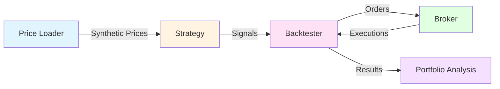
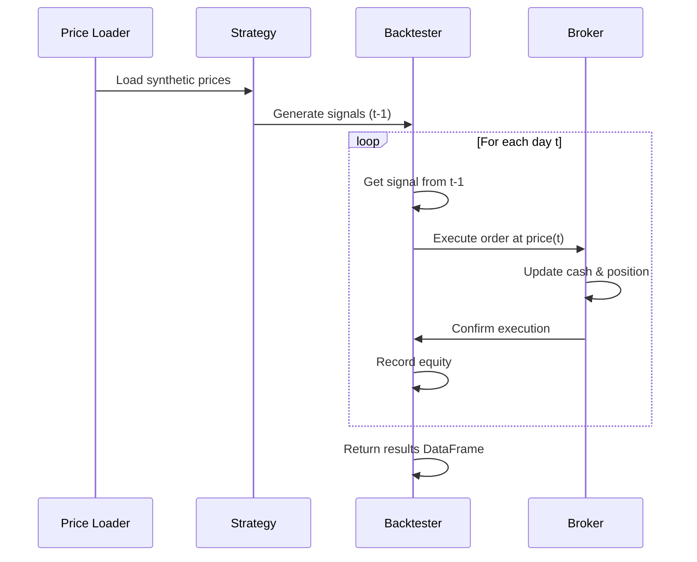
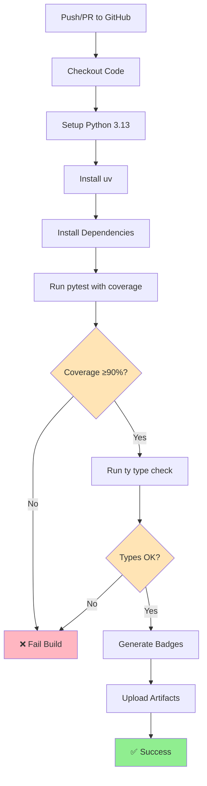

<div align="center">

# FINM32500 Assignment 5: Testing & CI in Financial Engineering

### A minimal daily-bar backtesting framework with comprehensive test coverage and continuous integration

<!-- CI/CD Status -->
[](https://github.com/elliotchung/FINM32500-Assignment-5/actions/workflows/ci.yml)
[](https://github.com/elliotchung/FINM32500-Assignment-5/actions)
[](https://github.com/elliotchung/FINM32500-Assignment-5/actions)
[](https://github.com/elliotchung/FINM32500-Assignment-5/actions)

<!-- Development Tools -->
[](https://github.com/astral-sh/uv)
[](https://github.com/astral-sh/ruff)
[](https://docs.astral.sh/ty/)

<!-- Project Info -->
[](https://www.python.org/downloads/)

---

**[📊 View Coverage Report](#-coverage-report)** •
**[🚀 Quick Start](#-quick-start)** •
**[🧪 Testing](#-testing-strategy)** •
**[🔄 CI/CD](#-continuous-integration)** •
**[📖 Docs](#-implementation-notes)**

</div>

---

## 📑 Table of Contents

- [Overview](#-overview)
- [Coverage Report](#-coverage-report)
- [Architecture](#-architecture)
  - [Project Structure](#project-structure)
  - [Component Flow](#component-flow)
  - [Design Principles](#design-principles)
- [Quick Start](#-quick-start)
  - [Prerequisites](#prerequisites)
  - [Installation](#installation)
  - [Running Tests](#running-tests)
  - [Running Type Checks](#running-type-checks)
  - [Running the Backtester](#running-the-backtester)
- [Testing Strategy](#-testing-strategy)
  - [Test Coverage](#test-coverage)
  - [Key Test Features](#key-test-features)
- [Continuous Integration](#-continuous-integration)
  - [CI Pipeline](#ci-pipeline)
  - [Coverage Requirements](#coverage-requirements)
- [Current Status](#-current-status)
- [Development Tools](#-development-tools)
- [Implementation Notes](#-implementation-notes)
- [Contributing](#-contributing)
- [Links](#-links)

---

## 📖 Overview

This backtesting framework implements a **simple daily-bar trading system** demonstrating software engineering best practices in quantitative finance. The focus is on **testability, determinism, and automated quality checks** rather than alpha generation.

### Core Components



| Component | Description | Key Features |
|-----------|-------------|--------------|
| **Price Loader** | Data generation | Synthetic prices, no external APIs |
| **Strategy** | Signal generation | `WindowedMovingAverageStrategy` with configurable window |
| **Broker** | Order execution | No slippage/fees, deterministic execution |
| **Backtester** | Loop orchestration | t-1 signals → time t trades |
| **Models** | Data structures | Market data, orders, positions, portfolios |

> **Philosophy**: The project emphasizes **test coverage and CI quality** over trading performance.

---

## 📊 Coverage Report

<div align="center">

### ✅ **>95% Coverage** • 🚀 **125 Tests** • ⚡ **~3-5s Runtime**

</div>

**[📥 Download HTML Coverage Report](https://github.com/elliotchung/FINM32500-Assignment-5/actions)**

Click on the latest workflow run → Artifacts → `coverage-reports` → Extract and open `htmlcov/index.html`

---

## 🏗️ Architecture

### Project Structure

```
FINM32500-Assignment-5/
│
├── 📁 src/backtester/          # Core backtesting engine
│   ├── __init__.py
│   ├── broker.py              # Order execution (buy/sell logic)
│   ├── engine.py              # Backtesting orchestration
│   ├── strategy.py            # WindowedMovingAverageStrategy
│   ├── price_loader.py        # Data loading utilities
│   ├── data_generator.py      # Synthetic price generation
│   └── models.py              # Core data structures
│
├── 🧪 tests/                   # Comprehensive test suite
│   ├── conftest.py            # Shared fixtures & test data
│   ├── test_broker.py         # Broker unit tests (30+ tests)
│   ├── test_engine.py         # Integration tests
│   ├── test_strategy.py       # Strategy logic tests
│   ├── test_price_loader.py   # Data loading tests
│   ├── test_data_generator.py # Generation tests
│   └── test_models.py         # Model validation tests
│
├── ⚙️ .github/workflows/
│   └── ci.yml                 # GitHub Actions CI pipeline
│
├── 📄 pyproject.toml           # Project config & dependencies
└── 📖 README.md                # This file
```

### Component Flow



### Design Principles

| Principle | Implementation | Benefit |
|-----------|----------------|---------|
| **🎯 Determinism** | Synthetic data with fixed seeds, no network calls | Reproducible tests |
| **🔬 Isolation** | Mock dependencies in unit tests | Independent component testing |
| **⚡ Speed** | Fast test suite (<10s, target <60s) | Rapid feedback loop |
| **📊 Coverage** | ≥90% line coverage, branch coverage enabled | High code quality |
| **🔒 Type Safety** | Type hints + `ty` static analysis | Catch errors early |

---

## 🚀 Quick Start

### Prerequisites

- Python **3.13+**
- [**uv**](https://github.com/astral-sh/uv) (recommended) or pip

### Installation

```bash
# Clone the repository
git clone https://github.com/elliotchung/FINM32500-Assignment-5.git
cd FINM32500-Assignment-5

# Install dependencies using uv (recommended)
uv sync

# Or using pip
pip install -e ".[dev]"
```

### Running Tests

<details>
<summary><b>📋 All test commands (click to expand)</b></summary>

```bash
# Run all tests with coverage report
uv run pytest

# Run specific test file
uv run pytest tests/test_broker.py

# Run with verbose output
uv run pytest -v

# Run tests matching a pattern
uv run pytest -k "broker"

# Generate HTML coverage report
uv run pytest --cov-report=html
open htmlcov/index.html

# Show missing lines in coverage
uv run pytest --cov-report=term-missing

# Run with coverage threshold check (fails if <90%)
uv run pytest --cov-fail-under=90
```

</details>

**Basic usage:**

```bash
# Run all tests with coverage
uv run pytest
```

### Running Type Checks

```bash
# Type check with ty
uv run ty check
```

### Running the Backtester

<details>
<summary><b>🎮 Example backtest commands (click to expand)</b></summary>

```bash
# Run example backtest with engine
uv run python -m src.backtester.engine

# Run strategy demo
uv run python -m src.backtester.strategy

# Run broker demo
uv run python -m src.backtester.broker

# Run custom backtest
uv run python main.py
```

</details>

---

## 🧪 Testing Strategy

### Test Coverage

<div align="center">

| Test Module | Tests | Focus Area |
|-------------|-------|------------|
| `test_broker.py` | 30+ | Order execution, cash/position tracking |
| `test_engine.py` | 25+ | Signal timing, equity calculations |
| `test_strategy.py` | 20+ | Signal generation, edge cases |
| `test_data_generator.py` | 15+ | Synthetic price generation |
| `test_models.py` | 20+ | Data structures, PnL calculations |
| `test_price_loader.py` | 15+ | Data loading and validation |
| **Total** | **125+** | **Comprehensive coverage** |

</div>

<details>
<summary><b>🔍 Detailed test categories (click to expand)</b></summary>

#### Broker Tests
- ✅ Order execution (buy/sell)
- ✅ Cash and position tracking
- ✅ Error handling and validation
- ✅ Round-trip trades
- ✅ Edge cases (zero quantity, negative prices)

#### Engine Tests
- ✅ Signal processing (t-1 → t timing)
- ✅ Trade execution flow
- ✅ Equity calculations
- ✅ Integration with broker and strategy
- ✅ Result DataFrame validation

#### Strategy Tests
- ✅ Signal generation logic
- ✅ Moving average calculations
- ✅ Window handling
- ✅ Edge cases (empty series, constant prices, NaNs)
- ✅ Signal consistency

#### Data Tests
- ✅ Synthetic price generation
- ✅ Volatility modeling
- ✅ Data validation
- ✅ Series properties

</details>

### Key Test Features

```python
# Example: Testing signal timing (t-1 → t)
def test_engine_uses_tminus1_signal(broker, strategy, prices):
    """Verify engine uses t-1 signal to trade at time t"""
    backtester = Backtester(strategy, broker)
    results = backtester.run(prices)

    # First day should have no trades (no t-1 signal available)
    assert results['position'].iloc[0] == 0

    # Invariant: equity = cash + position × price at all times
    equity_check = (results['equity'] ==
                   results['cash'] + results['position'] * results['price'])
    assert equity_check.all()
```

**Testing Approach:**

- **🧩 Fixtures**: Shared test data in `tests/conftest.py`
- **🎭 Mocking**: `unittest.mock` for component isolation
- **⚠️ Edge Cases**: Empty inputs, NaN handling, boundary conditions
- **🔄 Property Testing**: Validate invariants (e.g., equity = cash + position × price)
- **📏 Determinism**: Fixed seeds, no randomness in test data

---

## 🔄 Continuous Integration

### CI Pipeline



**Pipeline Steps:**

1. **🔍 Test Execution**: Full test suite with pytest
2. **📊 Coverage Check**: Fails if <90% line coverage
3. **🔒 Type Checking**: Static analysis with `ty`
4. **🏷️ Badge Generation**: Updates coverage, test duration, and type check badges
5. **📦 Artifact Upload**: Stores HTML coverage reports (30-day retention)

<details>
<summary><b>⚙️ CI Configuration excerpt (click to expand)</b></summary>

```yaml
# .github/workflows/ci.yml
name: CI Pipeline

on: [push, pull_request]

jobs:
  test:
    runs-on: ubuntu-latest
    steps:
      - uses: actions/checkout@v4

      - name: Install uv
        uses: astral-sh/setup-uv@v5

      - name: Set up Python
        run: uv python install 3.13

      - name: Install dependencies
        run: uv sync --all-extras --dev

      - name: Run tests with coverage
        run: uv run pytest --cov=src/backtester --cov-report=term-missing -v

      - name: Check coverage threshold
        run: |
          coverage report --fail-under=90
```

</details>

### Coverage Requirements

| Metric | Requirement | Current |
|--------|-------------|---------|
| **Line Coverage** | ≥90% | **>95%** ✅ |
| **Branch Coverage** | Tracked | **Enabled** ✅ |
| **Test Speed** | <60s | **~3-5s** ✅ |
| **Excluded** | `__main__`, `__repr__`, abstract methods | ✅ |

---

## 📈 Current Status

<div align="center">

| Category | Status | Details |
|----------|--------|---------|
| **Test Coverage** | ✅ **>95%** | Exceeds 90% requirement |
| **Test Speed** | ✅ **~3-5s** | Well under 60s limit |
| **Type Safety** | ✅ **Passing** | All files type-checked with `ty` |
| **CI/CD** | ✅ **Automated** | Pipeline on every push |
| **Code Quality** | ✅ **Clean** | Linted with Ruff |
| **Documentation** | ✅ **Complete** | Comprehensive README & docstrings |

</div>

---

## 🛠️ Development Tools

<div align="center">

| Tool | Purpose | Version |
|------|---------|---------|
| [**uv**](https://github.com/astral-sh/uv) | Fast Python package manager | Latest |
| [**pytest**](https://pytest.org/) | Testing framework | 8.4.2+ |
| [**pytest-cov**](https://pytest-cov.readthedocs.io/) | Coverage plugin | 7.0.0+ |
| [**Ruff**](https://github.com/astral-sh/ruff) | Fast Python linter | 0.14.1+ |
| [**ty**](https://docs.astral.sh/ty/) | Type checker | Latest |
| [**pandas**](https://pandas.pydata.org/) | Time series data structures | 2.3.3+ |
| [**numpy**](https://numpy.org/) | Numerical computations | 2.3.4+ |

</div>

---

## 📝 Implementation Notes

<details>
<summary><b>📈 WindowedMovingAverageStrategy</b></summary>

The strategy generates signals by comparing the current price to a windowed moving average:

```python
Signal Logic:
├── +1 (BUY)  : Current price > MA(window)
├──  0 (HOLD) : Current price = MA(window) OR insufficient data
└── -1 (SELL) : Current price < MA(window)
```

**Parameters:**
- `window`: Lookback period for moving average calculation

**Edge Cases Handled:**
- Insufficient data (i < window): Returns `0` (HOLD)
- NaN values in price series
- Empty or constant price series

</details>

<details>
<summary><b>🏦 Broker Mechanics</b></summary>

The broker executes orders with the following simplified model:

| Feature | Implementation | Rationale |
|---------|----------------|-----------|
| **Slippage** | ❌ None | Deterministic testing |
| **Fees** | ❌ Zero | Simplified model |
| **Latency** | ❌ Instant | Reproducible results |
| **Rejections** | ❌ All filled | Predictable behavior |

**Order Flow:**
```
market_order(side, qty, price)
├── side='buy'  → position += qty, cash -= qty × price
└── side='sell' → position -= qty, cash += qty × price
```

This simplified model ensures **100% reproducible test results**.

</details>

<details>
<summary><b>⚙️ Backtesting Loop</b></summary>

The engine follows strict timing discipline to prevent **look-ahead bias**:

```
For each day t:
  1. 📊 Compute signal based on data up to t-1
  2. 💰 Execute trade at close price of day t
  3. 📈 Record cash, position, and equity
```

**Key Design Choice:**
- Signal at `t-1` → Trade at `t` prevents using future information
- First day has no trade (no `t-1` signal exists)
- Equity invariant: `equity = cash + position × price`

**Example Timeline:**
```
Day 0: signal=N/A  → no trade    → position=0
Day 1: signal(0)   → trade at p1 → position updated
Day 2: signal(1)   → trade at p2 → position updated
...
```

</details>

<details>
<summary><b>🔧 Configuration</b></summary>

**pytest configuration** (`pyproject.toml`):
```toml
[tool.pytest.ini_options]
testpaths = ["tests"]
addopts = [
    "-v",
    "--cov=src/backtester",
    "--cov-report=term-missing",
    "--cov-report=html",
]
```

**Coverage configuration** (`pyproject.toml`):
```toml
[tool.coverage.run]
source = ["src/backtester"]
branch = true
omit = ["*/tests/*", "*/__pycache__/*"]

[tool.coverage.report]
fail_under = 90.0
exclude_lines = [
    "pragma: no cover",
    "if __name__ == .__main__.:",
]
```

</details>

---

## 🤝 Contributing

This is a course assignment project. For issues or suggestions:

1. 🐛 **Open an issue** on GitHub
2. 🎨 **Follow code style**: Ruff formatting
3. ✅ **Ensure tests pass**: Coverage ≥90%
4. 🔍 **Run type checks**: `uv run ty check`

---

## 📄 License

MIT License - see LICENSE file for details

---

## 🔗 Links

<div align="center">

**[📊 CI Dashboard](https://github.com/elliotchung/FINM32500-Assignment-5/actions)** •
**[📖 Template Repo](https://github.com/hyoung3/assignment5-testing-CI)**

</div>

---

<div align="center">

FINM32500 - Computational Finance in Python | Testing & Continuous Integration Assignment

</div>
